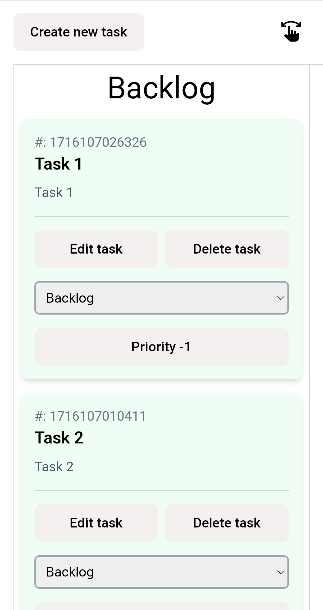

# Kanban app

## https://dimakolbasin.github.io/kanban-app/

---

## Getting Started with app

### Available Scripts

#### Node.js version ^18.0.0

In the project directory, you can run:

### `yarn`
### `yarn dev`

Runs the app in the development mode.\
Open http://localhost:5173 to view it in your browser.

The page will reload when you make changes.

---

## Example view app

### Desktop view

    

### Mobile view

    
    

    

